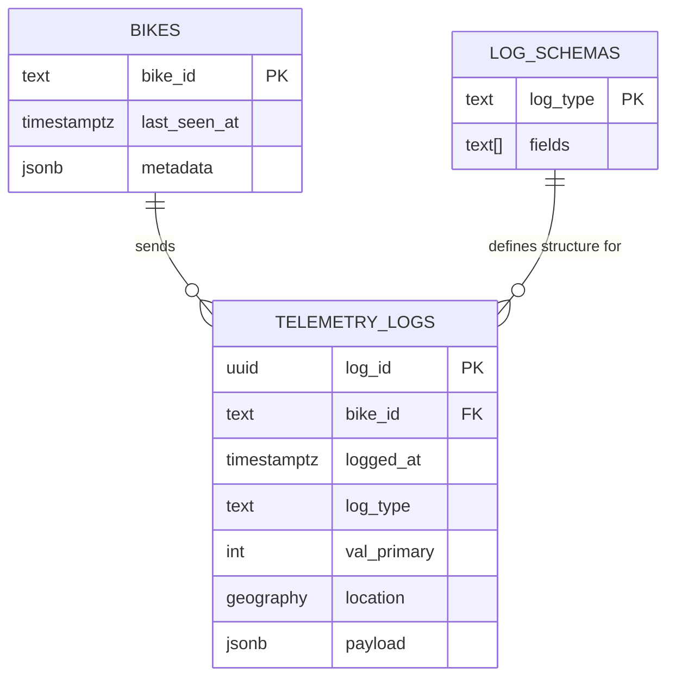

# Database Schema Design

This document details the PostgreSQL database design for the Raptee Backend. We use **PostgreSQL** with the **PostGIS** extension for efficient geospatial queries.

## ER Diagram

## Tables

### 1. `bikes` (Registry)
Stores the list of valid devices and their current state.

| Column | Type | Description |
| :--- | :--- | :--- |
| `bike_id` | `TEXT` | **Primary Key**. Unique identifier (e.g., `RAPTEE_001`). |
| `last_seen_at` | `TIMESTAMPTZ` | Auto-updated on every sync. Used for "Online/Offline" status. |
| `metadata` | `JSONB` | Flexible storage for device details (Color, FW Version, etc.). |

### 2. `telemetry_logs` (Time-Series Data)
Stores the massive stream of telemetry events.

| Column | Type | Description |
| :--- | :--- | :--- |
| `log_id` | `UUID` | **Part of PK**. Generated on the bike to ensure uniqueness. |
| `bike_id` | `TEXT` | **Part of PK**. Foreign Key to `bikes`. |
| `logged_at` | `TIMESTAMPTZ` | When the event happened (not when it was received). |
| `log_type` | `TEXT` | The type of event (e.g., `API_LATENCY`, `GPS_ANOMALY`). |
| `val_primary` | `INTEGER` | Extracted value for fast sorting (Latency in ms, Signal %). |
| `location` | `GEOGRAPHY` | PostGIS Point (Lat/Lng) for geospatial queries (Heatmaps). |
| `payload` | `JSONB` | The full data object. |

**Indexes:**
-   `idx_telemetry_seek`: `(bike_id, logged_at DESC, log_id DESC)` - Enables instant "Infinite Scroll" (Cursor Pagination).
-   `idx_telemetry_geo`: `GIST(location)` - Enables fast geospatial queries (e.g., "Find all anomalies in Chennai").

### 3. `log_schemas` (Global Definitions)
Stores the field definitions for each `log_type`. This allows the API to accept compact arrays (saving bandwidth) and expand them into full JSON objects.

| Log Type | Fields |
| :--- | :--- |
| `API_LATENCY` | `["api_call", "status", "status_code", "error_message", "signal_strength", "connection_state", "network_type"]` |
| `GPS_ANOMALY` | `["anomaly", "description", "jump_distance"]` |
