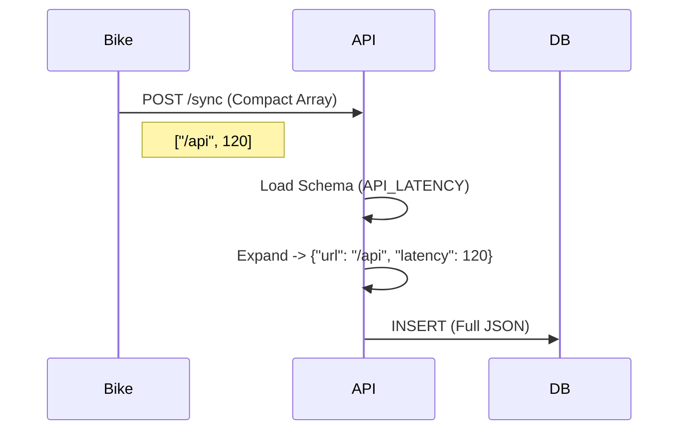

# Backend & API Reference

This document explains the backend architecture, data flow, and provides a detailed API reference.

## Data Flow: Compact Mode

To reduce bandwidth usage (critical for IoT), the backend supports a **Compact Mode**.

1.  **Client**: Sends data as an array of values: `["/api", 120, "OK"]`.
2.  **Server**: Looks up the Global Schema for that `log_type`.
3.  **Expansion**: Zips the schema keys with the values: `{"url": "/api", "latency": 120, "status": "OK"}`.
4.  **Database**: Stores the full JSON object in the `payload` column.



## API Reference

### 1. Sync Telemetry (Ingest)
**POST** `/api/v1/sync`

Ingests telemetry data. Uses **Idempotency** (UUIDs) to prevent duplicates.

**Request Body (Compact):**
```json
{
    "bike_id": "RAPTEE_PRO_005",
    "sync_timestamp": "2025-11-28T10:00:00Z",
    "columns": ["uuid", "timestamp", "type", "val_primary", "lat", "lng", "payload"],
    "data": [
        // Row 1: API Latency Log
        [
            "550e8400-e29b-41d4-a716-446655440000",
            "2025-11-28T10:00:01Z",
            "API_LATENCY",
            120,          // val_primary (Latency in ms)
            13.0827,      // Latitude
            80.2707,      // Longitude
            ["https://maps.google.com", "success", 200, "", 99, "connected", "Cellular"] // Payload Array
        ],
        // Row 2: GPS Anomaly Log
        [
            "550e8400-e29b-41d4-a716-446655440001",
            "2025-11-28T10:05:00Z",
            "GPS_ANOMALY",
            150,          // val_primary (Jump Distance)
            13.0830,
            80.2710,
            ["Jump Anomaly", "Jump of 150m", 150.0] // Payload Array
        ]
    ]
}
```

### 2. Provision Bike
**POST** `/api/v1/provision`

Registers a new bike or updates its metadata.

**Request Body:**
```json
{
    "bike_id": "RAPTEE_PRO_005",
    "metadata": {
        "color": "Matte Black",
        "fw_ver": "2.1.0",
        "mfg_date": "2025-01-15"
    }
}
```

### 3. Read Telemetry
**GET** `/api/v1/telemetry`

Retrieves logs with **Cursor-Based Pagination**.

**Query Parameters:**
-   `bike_id`: (Required) The ID of the bike.
-   `cursor`: (Optional) The `next_cursor` string from the previous response.

**Response:**
```json
{
    "data": [
        ["uuid-1", "2025-11-28T...", "API_LATENCY", 120, "{\"url\": \"...\"}"]
    ],
    "next_cursor": "MjAyNS0xMS0yOFQxMDowMDowMXw1NTBlODQwMC1lMjli..."
}
```

### 4. Delete Bike
**DELETE** `/api/v1/provision`

Deletes a bike and **all its associated telemetry data**.

**Query Parameters:**
-   `bike_id`: (Required) The ID of the bike to delete.

**Response:**
```json
{
    "status": "deleted",
    "bike_id": "RAPTEE_PRO_005"
}
```

### 5. Delete Telemetry
**DELETE** `/api/v1/telemetry`

Deletes **only** the telemetry logs for a specific bike. The bike registry remains.

**Query Parameters:**
-   `bike_id`: (Required) The ID of the bike.

**Response:**
```json
{
    "status": "deleted",
    "count": 150
}
```

### 6. Get Analytics
**GET** `/api/v1/analytics`

Retrieves analytics data for a specific bike.

**Query Parameters:**
-   `bike_id`: (Required) The ID of the bike.

**Response:**
Returns a JSON object with summary, API stats, connectivity stats, failures, and time series data.

### 7. Delete Bikes (Bulk)
**DELETE** `/api/v1/bikes`

Deletes multiple bikes or a single bike.

**Request Body (Bulk):**
```json
{
    "bike_ids": ["bike_1", "bike_2"]
}
```

**Query Parameters (Single):**
-   `bike_id`: The ID of the bike.

## Testing

The project includes a comprehensive test script to verify all endpoints.

```bash
go run cmd/test-api/main.go
```

This script will:
1.  Check `/health`.
2.  Provision test bikes.
3.  Sync telemetry data.
4.  Verify data retrieval.
5.  Test deletion of telemetry and bikes.

## Deployment

The project includes a `deploy.go` script for AWS ECR deployment.

1.  **Build**: `docker build` (Multi-stage build, resulting in a tiny Alpine image).
2.  **Push**: Pushes to AWS ECR.
3.  **Run**: Can be deployed to AWS App Runner or ECS.
